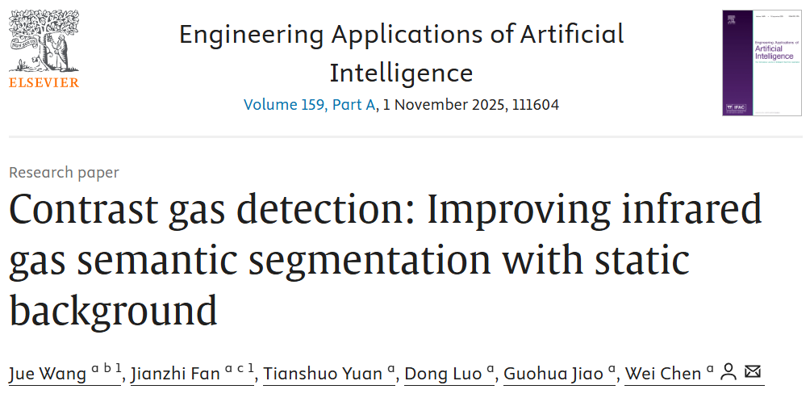

# Contrast gas detection: Improving infrared gas semantic segmentation with static background

# *Accepted to EAAI (JCR Q1)* 🎉🎉🥳🥳




### [Paper (Latest version)](https://www.sciencedirect.com/science/article/pii/S0952197625016069?ref=pdf_download&fr=RR-2&rr=95f32cf71b94d029#page=1.00&gsr=0) | [CGD dataset](#training-dataset-preparation)

----------------------------------------------------------

## Authors

- [Jue Wang*](https://a-new-b.github.io/)<sup>1,2</sup>, Jianzhi Fan*<sup>1,3</sup>, [Tianshuo Yuan](https://proalize.github.io/)<sup>1,3</sup>, Dong Luo<sup>1</sup>, Guohua Jiao<sup>1</sup>, Wei Chen<sup>1</sup>

- <sup>1</sup>[Shenzhen Institutes of Advanced Technology, Chinese Academy of Sciences](https://www.siat.ac.cn/), 
- <sup>2</sup>[Southern University of Science and Technology](www.sustech.edu.cn/en/) [Jue and Jianzhi contribute equally to this work.]
- <sup>3</sup>[University of Chinese Academy of Sciences](https://www.ucas.ac.cn/)

---------------------------------------------------------

## An overview of our CGNet


It processes a static background 𝐵0 and a gas release image 𝐺0 using ResNet for feature extraction. The gas Contrast Attention (GCA) mechanism compares feature 𝐵𝑖 and 𝐺𝑖 at each layer. Aggression Blocks integrate multi-level features, producing low-dimensional 𝑆𝑙 and high-dimensional 𝑆ℎ segmentations, which are refined and combined into the final segmentation 𝑆.

## An overview of our CGD dataset


Overview of the proposed CGD dataset designed for gas imaging and segmentation tasks. It comprises 9 distinct groups, categorized based on (1) the distance between the imaging system and the gas source, (2) the type of gases, and (3) the number of gas types present in the scene.

## The visualization of the prediction comparisons from different methods


The visualization of prediction comparisons from different methods, according to the rows from top to bottom in order: Thermal; Ground Truth; PSPNet; DeepLabV3+; YOLOv5; SegFormer; GasFormer; CGNet.


If you are interested in our work, please star ⭐ our project.

---------------------------------------------------------

## Getting Started

### Training dataset preparation
- Prepare our Gas-DB dataset: the dataset will be available after sending an email  explaining your purpose to tianshuoy@outlook.com, thanks!

## Code
### Setup
```
conda create -n CGNet python==3.10
conda activate CGNet
pip install -r requirements.txt
```

### Train
```
python train.py
```
### Test
```
python test.py
```
### Infetence
```
python inference.py
```

## Contact   
For any question, feel free to email <tianshuoy@outlook.com>.

# Citation
```
@article{wang2025contrast,
  title={Contrast gas detection: Improving infrared gas semantic segmentation with static background},
  author={Wang, Jue and Fan, Jianzhi and Yuan, Tianshuo and Luo, Dong and Jiao, Guohua and Chen, Wei},
  journal={Engineering Applications of Artificial Intelligence},
  volume={159},
  pages={111604},
  year={2025},
  publisher={Elsevier}
}
```